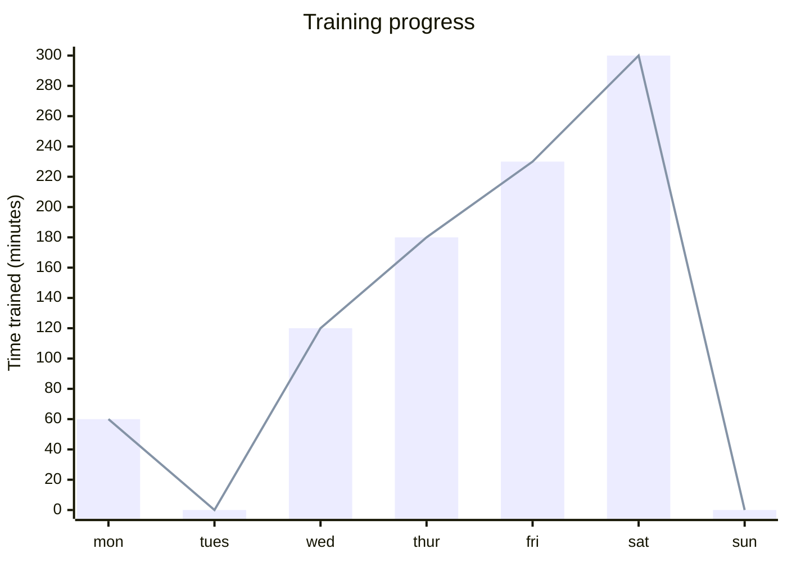
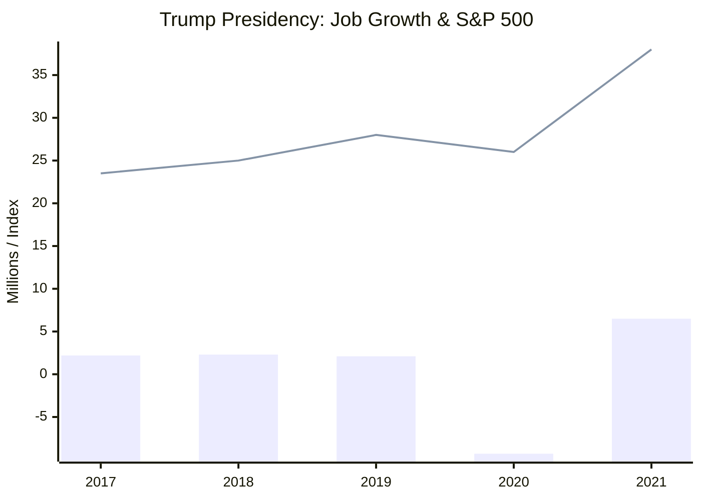
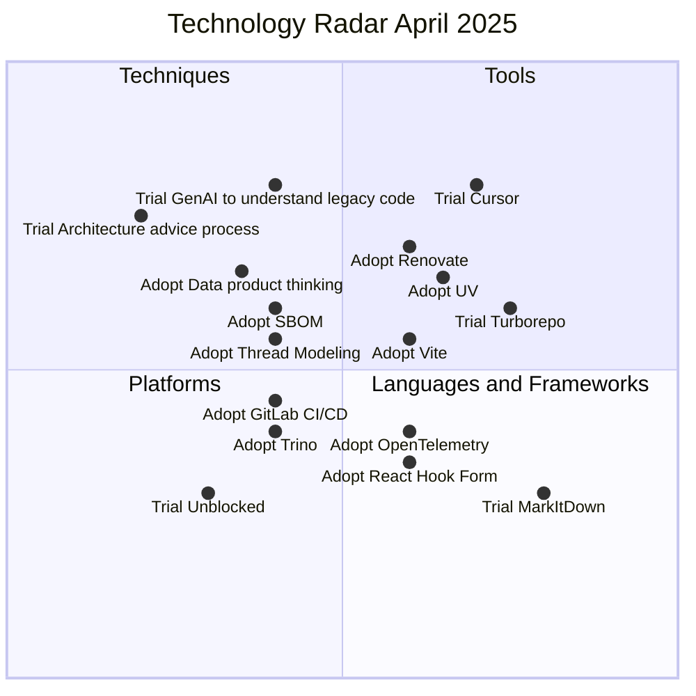
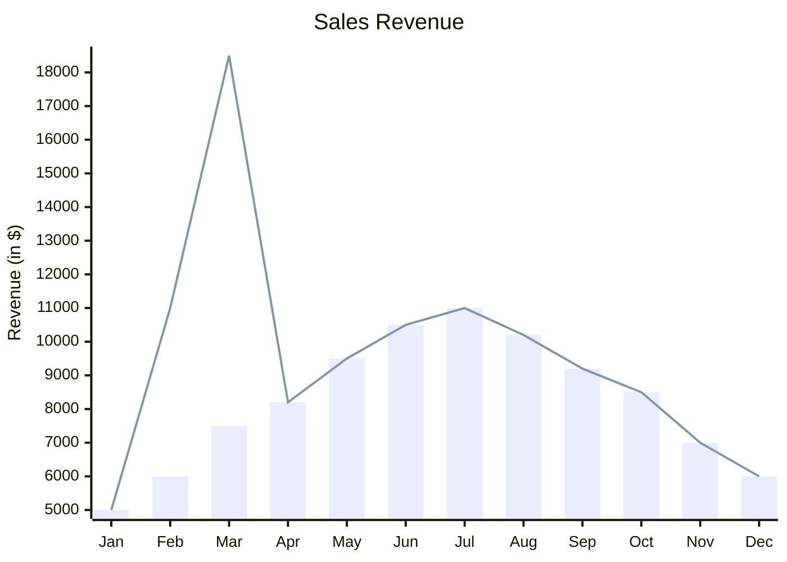

[[toc]]

## Text-to-chart

Text-to-chart is the process of describing a chart with text and letting software render it. [Mermaid](https://mermaid.js.org), a free and popular software library created in 2014 by Knut Sveidqvist, provides a Markdown-inspired text syntax for easy chart generation.  I´ve been picking up Mermaid to understand what it´s good for by creating the [<cite>markdown-it-mermaid-server</cite>](https://www.npmjs.com/package/markdown-it-mermaid-server) plugin, which renders Mermaid diagram definitions in SVG format as part of your Markdown translation – likely during the build process of a static website.

## Advantages
The idea of creating charts from text can be appealing, especially in the context of writing Markdown to create output for the web. Text-to-chart has similar advantages as Markdown. The approach allows to:
- Write chart definitions with any text editor, which means, you can stay in your familiar writing environment without installing additional software to create charts. 
- Save time because the focus is on writing, not on formatting. It´s important to mention, the time-saving aspect is only achieved if the text-to-chart software suits your context in terms of syntax and available diagram types!
- The chart graphics-format is created automatically – in the case of Mermaid it can be SVG, PNG or PDF. I opted for SVG, because it is lightweight, scales well up and down, and fits well into the web.
- The resulting charts have a standardized appearance and can be themed to a certain look, which allows for streamlined handling and understanding in collaborative contexts. For Mermaid, you can achieve some theming, but not all theming for the different chart types works equally well when rendering on the server.
- The chart definitions are text and as such can be versioned in an excellent way by Git.
- The charts can be rendered as part of the build process of a static website on the server, which means users get the charts as quick and as lean as possible delivered to their web browsers without the need to run JavaScript on the browser to create the charts.

## Disadvantages
Downsides of the approach are:
- The syntax for text-to-chart, in this case the Mermaid-syntax, as simple as the maintainers are aiming to get it, is not as straightforward as Markdown syntax. Personally I have to lookup how to achieve  certain results on the Mermaid website.
- When rendering the charts within the build process of a static website, the feedback cycle to see what chart is getting produced by your textual definition is slowed down, because every change of the definition text requires a build step to see the graphic results.
- At least for Mermaid, the produced charts are basic. Some might find they are not polished enough.
- I cannot define image alt text or subtitles with Mermaid, because the chart definition syntax is not supporting it.


## Examples 

All given examples are rendered with the [<cite>markdown-it-mermaid-server</cite>](https://www.npmjs.com/package/markdown-it-mermaid-server) plugin on the server.






The following quadrant chart is a reference to the famous [ThoughtWorks Technology Radar](https://www.thoughtworks.com/radar). In the context of the current document it is created with the help of Mermaid from a text definition.



The text definition to create the chart is the following:

```
quadrantChart
title Technology Radar April 2025
quadrant-1 Tools
quadrant-2 Techniques
quadrant-3 Platforms
quadrant-4 Languages and Frameworks
Adopt Vite: [0.6, 0.55]
Adopt UV: [0.65, 0.65]
Adopt Renovate: [0.6, 0.7]
Adopt Thread Modeling: [0.4, 0.55]
Adopt SBOM: [0.4, 0.6]
Adopt Data product thinking: [0.35, 0.66]
Adopt GitLab CI/CD: [0.4, 0.45]
Adopt Trino: [0.4, 0.4]
Adopt OpenTelemetry: [0.6, 0.4]
Adopt React Hook Form: [0.6, 0.35]
Trial Cursor: [0.7, 0.8]
Trial Turborepo: [0.75, 0.6]
Trial Architecture advice process: [0.2, 0.75]
Trial GenAI to understand legacy code: [0.4, 0.8]
Trial Unblocked: [0.3, 0.3]
Trial MarkItDown: [0.8, 0.3]
```

The original [Technology Radar](https://www.thoughtworks.com/radar) is a very specific, interactive and purpose-built infographic. In such a case the limitations of the text-to-chart approach become visible:
- The Mermaid chart is by far not as elaborate as the original ThoughtWorks chart in terms of design, color, interaction, and font usage.
- Links from data points to explanations are missing.
- There is no formatting to the exact point like in the ThoughtWorks chart.

You can do Quadrant charts with Mermaid, but 

Is it the case that text-to-chart with Mermaid is better suited for standard charts? Maybe an xy-chart, like the one below, makes more sense:


