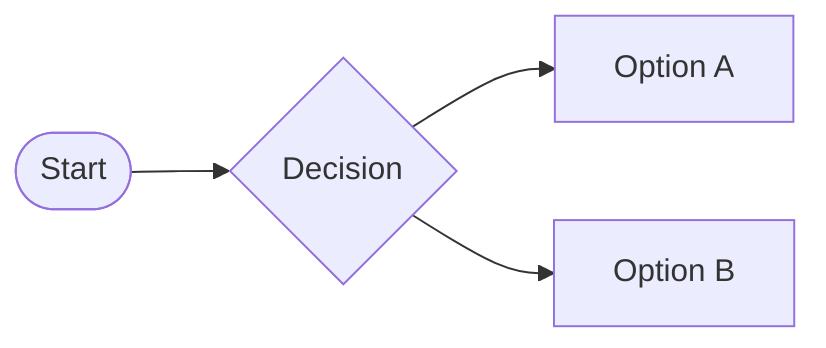
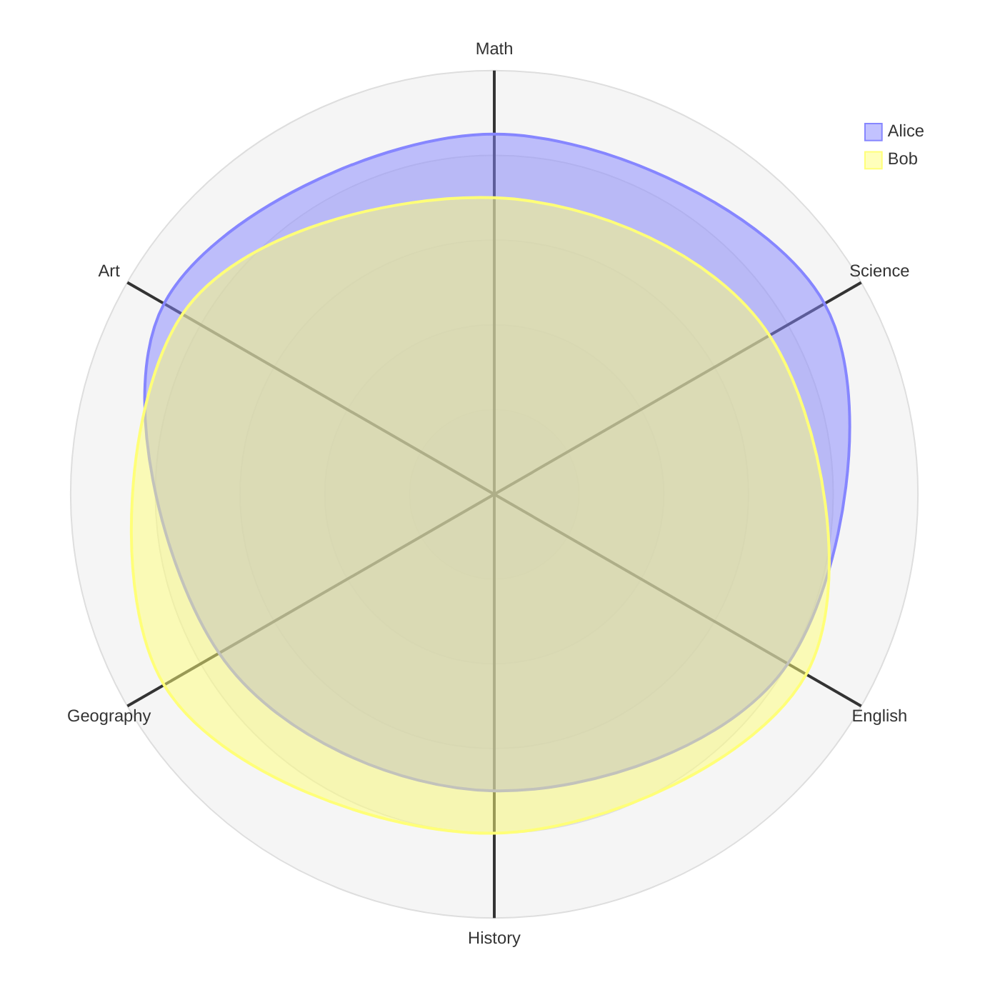
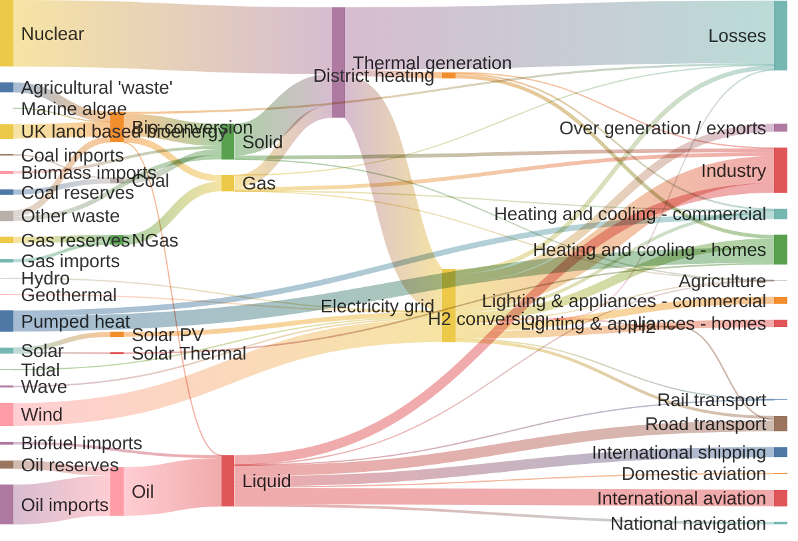
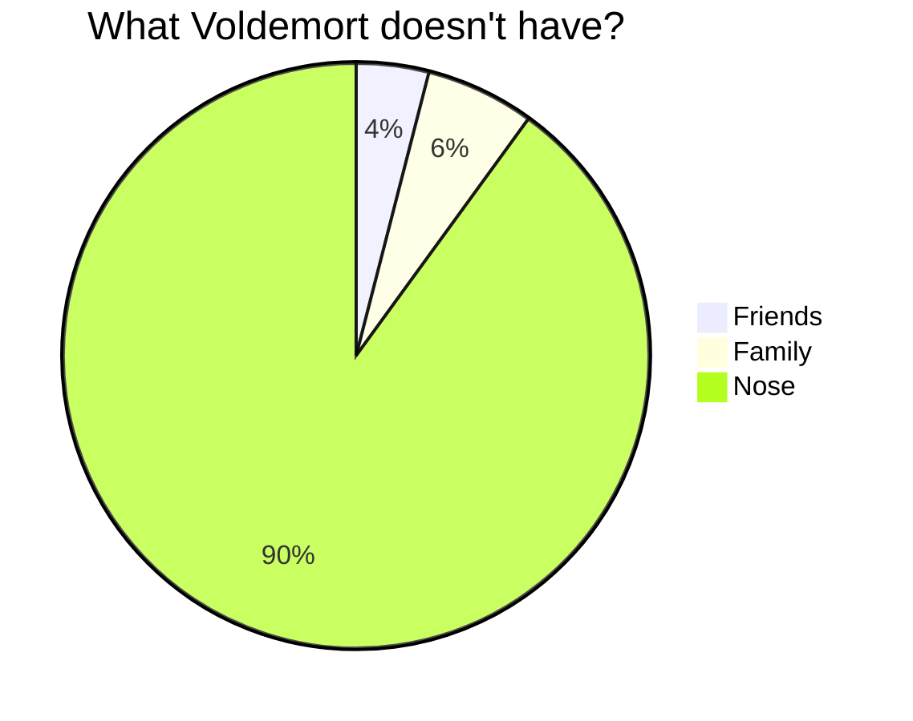
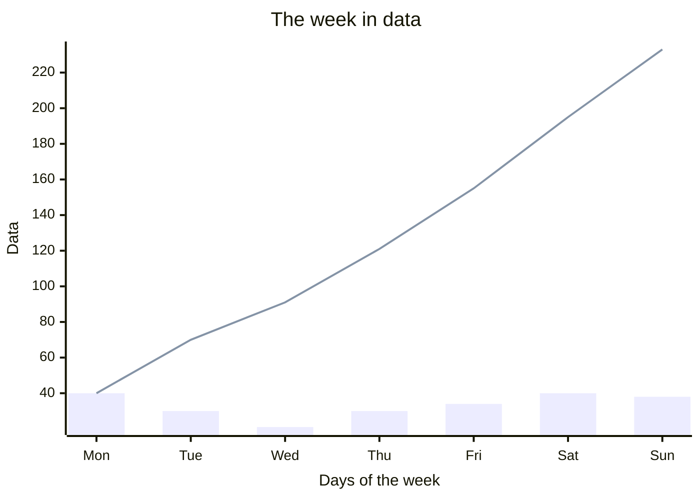

[[toc]]

## Text-to-chart, what is it good for?

The idea of creating charts from text is appealing to me since I got aware of Mermaid several years ago. Especially in the context creating output for the web by writing Markdown, text-to-chart has similar advantages as [Markdown](https://daringfireball.net/projects/markdown/syntax). The approach allows to:

- **Use your environment**: Write chart definitions with any text editor, which means, you can stay in your familiar writing environment without installing additional software to create the charts.
- **Quick**: Save time because the focus of the chart creator is on data, content and writing, and not on formatting. It´s important to mention, the time-saving aspect is only achieved if the text-to-chart software suits your context in terms of syntax and available diagram types!
- **Ideal web output**: The charts can be created in a web-friendly output format – in the case of Mermaid it can be SVG, PNG or PDF. SVG, I believe, is a good starting point to be used for charts on the web, because it is lightweight and scales well up and down.
- **Standardized output**: The resulting charts have a standardized appearance and can be themed to a certain look, which means you can fit the charts into your design language. This again might help to improve shared understanding in collaborative contexts, because even with multiple people creating charts, the charts are rendered by the same rules and thus create a kind of a shared language.
- **Up-to-date charts**: The possibility of quick text-based changes leading to optimal output rendering helps to avoid what the Mermaid creator Knut Sveidqvist calls doc-rot, the gap between a current development state and the outdated diagram documentation aiming to describe that state. This gives a hint that Mermaid has a tendency to provide diagrams that fit well into the software development domain, like flowcharts or sequence diagrams. Other text-to-chart software can have a different focus and produce different diagram types with the same general advantages for your workflow. The benefit of always having up-to-date charts published in the correct standardized look on even a large website is huge, in my view.
- **Version control**: The chart definitions are made of text and as such can be versioned in an excellent way by Git.
- **Fast and lightweight delivery**: Sometimes the charts can be rendered as part of the build process of a static website on the server, which means users get the charts as quick and as lean as possible delivered to their web browsers, without the need to run JavaScript on the browser. This can be done with Mermaid and it makes sense in that case, because Mermaid charts do not offer options for interactive changes.
- **Interaction**: When the charts are rendered by JavaScript on the browser client, as opposed to the server, you can have other advantages, like interactive charts, allowing to filter out certain visualization aspects to analyze the data. ECharts delivers charts this way.

## Could there be problems?

There can be downsides:

- **Syntax**: The syntax of text-to-chart, in this case the Mermaid-syntax, as simple as the maintainers are aiming to keep it, takes time to learn. I sometimes have to visit the Mermaid website to understand how to achieve certain results. Same comes true with code-to-chart in ECharts. There are certain building blocks which appear repeatedly, which helps a lot getting into the concepts, but the resulting charts can cover such a wide range of visualization variants that it´s natural the code handling requires learning.
- **Feedback loop**: When rendering the charts within the build process of a static website, the feedback cycle to see what chart is getting produced by processing your textual definition is slowed down, because every change of the chart definition requires a build step to see the chart results.  To overcome this problem, Mermaid has a free online editor [mermaid.live](https://mermaid.live/) which you can use to set up diagrams and see immediately how your chart does look like. Once you have your desired result, you can copy your code and paste it into the final location. ECharts is the same. Their online editor is [echarts.apache.org/examples/editor.html](https://echarts.apache.org/examples/editor.html).
- **Software complexity**: Generating charts at build time or at run time is more complex than creating an image once and referencing that image from that point on in your website. You can be sure a web browser is able to visualize the image 20 years into the future without the need for you to ever touch it. Generating charts on the other hand will touch your chart definition with every build or with every page view and will carry out computational tasks to translate your text into a graphic. Sure there are chances something might break and your users will end up seeing no chart at all. You have to have your software stack under control to keep this in a working state.

## Mermaid

Mermaid has its roots in creating *development charts* from text, like flowcharts, sequence diagrams, and state diagrams. The mind map chart  can as well be seen to be in this domain. A strength of Mermaid is the lean syntax for describing the charts, which is often close to natural language, and Sveidqvist´s intent to fight doc-rot is well addressed in my view. There are good ideas in Mermaid, but the actual execution could be more standardized. The charts sometimes appear to me as not generated by the same software but by different software stacks.

Mermaid supports class diagrams, but generating them directly from your code base with a different software might be more effective.


### Mermaid Flowchart

You can create a flowchart by adding a few lines of text to your Markdown document, like below:

~~~markdown

~~~

The above  chart definition will produce the following diagram, and the simplicity of the creation is a source of joy to me.

```mermaid
figcaption A basic Mermaid-generated flowchart. I usually start with describing the flows between the nodes and then add a second block to describe how the nodes should be shaped.

alt A flowchart starting at a node "Start", flowing to a decision point "Decision", from where the flow can go further to either node "Option A" or "Option B"

flowchart LR

start --> decision
decision --> optionA & optionB

start(["Start"])
decision{"Decision"}
optionA["Option A"]
optionB["Option B"]
```

The flowchart syntax is powerful and simple. It´s basically nodes and edges to connect nodes, which, as a general concept, can be applied in many communication situations. You get the complete syntax on the Mermaid site at [Flowcharts – basic syntax](https://mermaid.js.org/syntax/flowchart.html). Visit the [Mermaid docs](https://mermaid.js.org/intro/) to get an overview of all available diagram types.

### Mermaid Radar Chart

Mermaid does also have more *exotic* chart types, like the radar or the Sankey.

```mermaid
figcaption A Mermaid-generated radar chart, made with a few lines of text

radar-beta

axis m["Math"], s["Science"], e["English"], h["History"], g["Geography"], a["Art"]
curve a["Alice"]{85, 90, 80, 70, 75, 90}
curve b["Bob"]{70, 75, 85, 80, 90, 85}

max 100
min 0
```

+++ How to embed into Markdown
~~~markdown

~~~
+++

### Mermaid Sankey Chart

```mermaid
---
config:
  sankey:
    showValues: false
---
figcaption A Sankey chart generated by Mermaid

sankey-beta

Agricultural waste,Bio-conversion,124.729
Bio-conversion,Liquid,0.597
Bio-conversion,Losses,26.862
Bio-conversion,Solid,280.322
Bio-conversion,Gas,81.144
Biofuel imports,Liquid,35
Biomass imports,Solid,35
Coal imports,Coal,11.606
Coal reserves,Coal,63.965
Coal,Solid,75.571
District heating,Industry,10.639
District heating,Heating and cooling - commercial,22.505
District heating,Heating and cooling - homes,46.184
Electricity grid,Over generation / exports,104.453
Electricity grid,Heating and cooling - homes,113.726
Electricity grid,H2 conversion,27.14
Electricity grid,Industry,342.165
Electricity grid,Road transport,37.797
Electricity grid,Agriculture,4.412
Electricity grid,Heating and cooling - commercial,40.858
Electricity grid,Losses,56.691
Electricity grid,Rail transport,7.863
Electricity grid,Lighting & appliances - commercial,90.008
Electricity grid,Lighting & appliances - homes,93.494
Gas imports,NGas,40.719
Gas reserves,NGas,82.233
Gas,Heating and cooling - commercial,0.129
Gas,Losses,1.401
Gas,Thermal generation,151.891
Gas,Agriculture,2.096
Gas,Industry,48.58
Geothermal,Electricity grid,7.013
H2 conversion,H2,20.897
H2 conversion,Losses,6.242
H2,Road transport,20.897
Hydro,Electricity grid,6.995
Liquid,Industry,121.066
Liquid,International shipping,128.69
Liquid,Road transport,135.835
Liquid,Domestic aviation,14.458
Liquid,International aviation,206.267
Liquid,Agriculture,3.64
Liquid,National navigation,33.218
Liquid,Rail transport,4.413
Marine algae,Bio-conversion,4.375
NGas,Gas,122.952
Nuclear,Thermal generation,839.978
Oil imports,Oil,504.287
Oil reserves,Oil,107.703
Oil,Liquid,611.99
Other waste,Solid,56.587
Other waste,Bio-conversion,77.81
Pumped heat,Heating and cooling - homes,193.026
Pumped heat,Heating and cooling - commercial,70.672
Solar PV,Electricity grid,59.901
Solar Thermal,Heating and cooling - homes,19.263
Solar,Solar Thermal,19.263
Solar,Solar PV,59.901
Solid,Agriculture,0.882
Solid,Thermal generation,400.12
Solid,Industry,46.477
Thermal generation,Electricity grid,525.531
Thermal generation,Losses,787.129
Thermal generation,District heating,79.329
Tidal,Electricity grid,9.452
UK land based bioenergy,Bio-conversion,182.01
Wave,Electricity grid,19.013
Wind,Electricity grid,289.366
```

+++ How to embed into Markdown
~~~markdown

~~~
+++

### Mermaid Pie Chart

Other examples are the xy chart or the pie chart. Those charts can be useful, but they are fairly simple and some might find they are not polished enough. The syntax isn´t consistent either. The xy chart requires a title to be in double quotes to avoid having all spaces removed from the title text, while for the pie chart double quotes are supported, but the title would be better without quotes because the quotes are rendered into the diagram. Also, the titles of the two diagram types are rendered in different sizes. amd generally, font sizes vary across the different Mermaid chart types. At the beginning of this document I mentioned standardized output creation from text definitions, which is not to 100% achieved in this case. It is a probably a minor complaint, depending on your context, but I would expect these things to be aligned when using a charting software.

```mermaid
figcaption A simple pie chart generated by Mermaid

pie

title What Voldemort doesn't have?
"Friends" : 2
"Family" : 3
"Nose" : 45
```

+++ How to embed into Markdown
~~~markdown

~~~
+++

### Mermaid XY Chart

```mermaid
figcaption A simple xy chart generated by Mermaid. The bars represent data points for each day of the week. The line represents the cumulated data points from day to day. This visualization is clear as long as you have a single data series to visualize (like only bars, or only the line). When having more than one data series, I´m missing an automatically generated legend to explain the data within the chart. The explanation can only be given in addition to what Mermaid does, for example by putting your own description as some sort of legend into a <code>figcaption</code>, which is not ideal in my view. A legend should really be part of any information graphic.

xychart-beta

title "The week in data"
x-axis "Days of the week" [Mon, Tue, Wed, Thu, Fri, Sat, Sun]
y-axis "Data"
bar "Per day" [40, 30, 21, 30, 34, 40, 38]
line "Cumulated over days" [40, 70, 91, 121, 155, 195, 233]
```

+++ How to embed into Markdown
~~~markdown

~~~
+++

### Mermaid Chart Appearance

The appearance of each Mermaid chart can be configured through a frontmatter configuration within the chart definition, see [<cite>Frontmatter config</cite>](https://mermaid.js.org/config/configuration.html#frontmatter-config) in the Mermaid documentation. In addition, a software developer can apply a custom styling to  all diagrams by using a Mermaid config object and a theme CSS.

The application of styles to the diagrams is inconsistent, not well documented, and I didn´t find it straight forward. For example, you can set the colors of the bars and lines for the xy chart in the Mermaid config object (which is JSON), but the background of the xy chart needs to be set via the theme CSS. At some point I refrained from doing my own styling and now I just use the default. Unfortunately that means I do not have a dark mode switch, because Mermaid is not supporting an automatic switch by reacting to system settings out of the box, and the font size of the data series legends is too tiny, but I have to accept that.

In the end, the limitations of Mermaid´s general purpose charts made me watch out for other solutions and I came to ECharts.


## ECharts

ECharts is a free and capable charting software under the Apache License 2.0. It covers general purpose charts in various flavours and can be used for specific charts that go well beyond of what I would expect to get from a charting software. ECharts are rendered on the client and can be interactive in the sense that users are able to filter out certain data series to shift focus on other data series to better analyze the data.

I´m impressed by the [ECharts demo page](https://echarts.apache.org/examples/index.html).

Other than Mermaid, ECharts does not rely on text to describe a chart. Instead the chart has to be defined with JavaScript. It´s a steeper learning curve, but the concepts are well thought through, pretty flexible, and the resulting charts can be tailored to certain needs much better than with Mermaid. To directly jump in, let´s pick up some chart types we rendered previously with Mermaid and do the same with ECharts.

### ECharts Pie Chart

```echarts
const config = {
  title: {
    text: 'What Voldemort doesn´t have',
  },
  figcaption: `A simple pie chart rendered by ECharts.
  You will probably notice it´s more interactive,
  more polished, and much closer to the styling of the hosting website than the corresponding Mermaid chart.`,
  tooltip: {
    trigger: 'item'
  },
  series: [
    {
      type: 'pie',
      radius: '70%',
      data: [
        { value: 2, name: 'Friends' },
        { value: 3, name: 'Family' },
        { value: 45, name: 'Nose' }
      ],
      label: {
        show: true,
        formatter: containerWidth > 600 ? '{b}: {c} ≈ {d}%' : '{b} {c}'
        // {b} = data name
        // {c} = raw value
        // {d} = percentage
      }
  }
  ]
};
```

+++ How to embed into Markdown
~~~markdown
```echarts
const config = {
  title: {
    text: 'What Voldemort doesn´t have',
  },
  tooltip: {
    trigger: 'item'
  },
  series: [
    {
      type: 'pie',
      radius: '70%',
      data: [
        { value: 2, name: 'Friends' },
        { value: 3, name: 'Family' },
        { value: 45, name: 'Nose' }
      ],
      label: {
        show: true,
        formatter: containerWidth > 600 ? '{b}: {c} ≈ {d}%' : '{b} {c}'
        // {b} = data name
        // {c} = raw value
        // {d} = percentage
      }
  }
  ]
};
```
~~~
+++

### ECharts XY Chart


```echarts
const config = {
  title: {
    text: 'The week in data',
  },
  figcaption: `The ECharts version of the xy chart, which is named a combined line/bar chart in ECharts. It´s easy to have a proper legend for the visualized data, and again, the chart is interactive.`,
  xAxis: {
    type: 'category',
    data: ['Mon', 'Tue', 'Wed', 'Thu', 'Fri', 'Sat', 'Sun'],
    name: containerWidth > 600 ? 'Days of the week': ''
  },
  yAxis: {
    type: 'value',
    name: containerWidth > 600 ? 'Data' : ''
  },
  legend: {
    data: ['Per day', 'Cumulated over days']
  },
  series: [
      {
      name: 'Per day',
      data: [40, 30, 21, 30, 34, 40, 38],
      type: 'bar'
    },
    {
      name: 'Cumulated over days',
      data: [40, 70, 91, 121, 155, 195, 233],
      type: 'line'
    }
  ]
};
```

+++ How to embed into Markdown
~~~markdown
```echarts
const config = {
  title: {
    text: 'The week in data',
  },
  xAxis: {
    type: 'category',
    data: ['Mon', 'Tue', 'Wed', 'Thu', 'Fri', 'Sat', 'Sun'],
    name: containerWidth > 600 ? 'Days of the week' : ''
  },
  yAxis: {
    type: 'value',
    name: containerWidth > 600 ? 'Data' : ''
  },
  legend: {
    data: ['Per day', 'Cumulated over days']
  },
  series: [
      {
      name: 'Per day',
      data: [40, 30, 21, 30, 34, 40, 38],
      type: 'bar'
    },
    {
      name: 'Cumulated over days',
      data: [40, 70, 91, 121, 155, 195, 233],
      type: 'line'
    }
  ]
};
```
~~~
+++

### ECharts Radar Chart


```echarts
 const config = {
  figcaption: 'The radar chart, generated by ECharts',
  legend: {
    data: ['Alice', 'Bob']
  },
  radar: {
    splitLine: {
      show: false
    },
    splitArea: {
      show: false
    },
    indicator: [
      { name: 'Math', max: 100 },
      { name: 'Science', max: 100 },
      { name: 'English', max: 100 },
      { name: 'History', max: 100 },
      { name: 'Geography', max: 100 },
      { name: 'Art', max: 100 }
    ]
  },
  series: [
    {
      type: 'radar',
      data: [
        {
          value: [85, 90, 80, 70, 75, 90],
          name: 'Alice'
        },
        {
          value: [70, 75, 85, 80, 90, 85],
          name: 'Bob'
        }
      ]
    }
  ]
};
```

+++ How to embed into Markdown
~~~markdown
```echarts
const config = {
  legend: {
    data: ['Alice', 'Bob']
  },
  radar: {
     splitLine: {
      show: false
    },
    splitArea: {
      show: false
    },
    indicator: [
      { name: 'Math', max: 100 },
      { name: 'Science', max: 100 },
      { name: 'English', max: 100 },
      { name: 'History', max: 100 },
      { name: 'Geography', max: 100 },
      { name: 'Art', max: 100 }
    ]
  },
  series: [
    {
      type: 'radar',
      data: [
        {
          value: [85, 90, 80, 70, 75, 90],
          name: 'Alice'
        },
        {
          value: [70, 75, 85, 80, 90, 85],
          name: 'Bob'
        }
      ]
    }
  ]
};
```
~~~
+++

### ECharts Sankey Chart


```echarts
const config = {
  figcaption: 'The Sankey chart, generated by ECharts',
  tooltip: {
    trigger: "item",
    triggerOn: "mousemove",
  },
  animation: true,
  series: [
    {
      type: "sankey",
      bottom: "10%",
      emphasis: {
        focus: "adjacency",
      },
      data: [
        {
          name: "Agricultural 'waste'",
        },
        { name: "Bio-conversion" },
        { name: "Biofuel imports" },
        { name: "Biomass imports" },
        { name: "Coal imports" },
        { name: "Coal reserves" },
        { name: "Coal" },
        {
          name: "District heating",
        },
        {
          name: "Electricity grid",
        },
        { name: "Gas imports" },
        { name: "Gas reserves" },
        {
          name: "Gas",
        },
        { name: "Geothermal" },
        { name: "H2 conversion" },

        { name: "H2" },
        { name: "Hydro" },
        { name: "Liquid" },
        { name: "Marine algae" },
        { name: "NGas" },
        { name: "Nuclear" },
        { name: "Oil imports" },
        { name: "Oil reserves" },
        { name: "Oil" },
        { name: "Other waste" },
        {
          name: "Pumped heat",
        },
        { name: "Solar PV" },
        {
          name: "Solar Thermal",
        },
        { name: "Solar" },
        {
          name: "Thermal generation",
        },
        { name: "Tidal" },
        {
          name: "UK land based bioenergy",
        },
        { name: "Wave" },
        { name: "Wind" },
      ],
      links: [
        {
          source: "Agricultural 'waste'",
          target: "Bio-conversion",
          value: 124.729,
        },
        { source: "Bio-conversion", target: "Liquid", value: 0.597 },
        { source: "Bio-conversion", target: "Losses", value: 26.862 },
        { source: "Bio-conversion", target: "Solid", value: 280.322 },
        { source: "Bio-conversion", target: "Gas", value: 81.144 },
        { source: "Biofuel imports", target: "Liquid", value: 35 },
        { source: "Biomass imports", target: "Solid", value: 35 },
        { source: "Coal imports", target: "Coal", value: 11.606 },
        { source: "Coal reserves", target: "Coal", value: 63.965 },
        { source: "Coal", target: "Solid", value: 75.571 },
        { source: "District heating", target: "Industry", value: 10.639 },
        {
          source: "District heating",
          target: "Heating and cooling - commercial",
          value: 22.505,
        },
        {
          source: "District heating",
          target: "Heating and cooling - homes",
          value: 46.184,
        },
        {
          source: "Electricity grid",
          target: "Over generation / exports",
          value: 104.453,
        },
        {
          source: "Electricity grid",
          target: "Heating and cooling - homes",
          value: 113.726,
        },
        { source: "Electricity grid", target: "H2 conversion", value: 27.14 },
        { source: "Electricity grid", target: "Industry", value: 342.165 },
        { source: "Electricity grid", target: "Road transport", value: 37.797 },
        { source: "Electricity grid", target: "Agriculture", value: 4.412 },
        {
          source: "Electricity grid",
          target: "Heating and cooling - commercial",
          value: 40.858,
        },
        { source: "Electricity grid", target: "Losses", value: 56.691 },
        { source: "Electricity grid", target: "Rail transport", value: 7.863 },
        {
          source: "Electricity grid",
          target: "Lighting & appliances - commercial",
          value: 90.008,
        },
        {
          source: "Electricity grid",
          target: "Lighting & appliances - homes",
          value: 93.494,
        },
        { source: "Gas imports", target: "NGas", value: 40.719 },
        { source: "Gas reserves", target: "NGas", value: 82.233 },
        {
          source: "Gas",
          target: "Heating and cooling - commercial",
          value: 0.129,
        },
        { source: "Gas", target: "Losses", value: 1.401 },
        { source: "Gas", target: "Thermal generation", value: 151.891 },
        { source: "Gas", target: "Agriculture", value: 2.096 },
        { source: "Gas", target: "Industry", value: 48.58 },
        { source: "Geothermal", target: "Electricity grid", value: 7.013 },
        { source: "H2 conversion", target: "H2", value: 20.897 },
        { source: "H2 conversion", target: "Losses", value: 6.242 },
        { source: "H2", target: "Road transport", value: 20.897 },
        { source: "Hydro", target: "Electricity grid", value: 6.995 },
        { source: "Liquid", target: "Industry", value: 121.066 },
        { source: "Liquid", target: "International shipping", value: 128.69 },
        { source: "Liquid", target: "Road transport", value: 135.835 },
        { source: "Liquid", target: "Domestic aviation", value: 14.458 },
        { source: "Liquid", target: "International aviation", value: 206.267 },
        { source: "Liquid", target: "Agriculture", value: 3.64 },
        { source: "Liquid", target: "National navigation", value: 33.218 },
        { source: "Liquid", target: "Rail transport", value: 4.413 },
        { source: "Marine algae", target: "Bio-conversion", value: 4.375 },
        { source: "NGas", target: "Gas", value: 122.952 },
        { source: "Nuclear", target: "Thermal generation", value: 839.978 },
        { source: "Oil imports", target: "Oil", value: 504.287 },
        { source: "Oil reserves", target: "Oil", value: 107.703 },
        { source: "Oil", target: "Liquid", value: 611.99 },
        { source: "Other waste", target: "Solid", value: 56.587 },
        { source: "Other waste", target: "Bio-conversion", value: 77.81 },
        {
          source: "Pumped heat",
          target: "Heating and cooling - homes",
          value: 193.026,
        },
        {
          source: "Pumped heat",
          target: "Heating and cooling - commercial",
          value: 70.672,
        },
        { source: "Solar PV", target: "Electricity grid", value: 59.901 },
        {
          source: "Solar Thermal",
          target: "Heating and cooling - homes",
          value: 19.263,
        },
        { source: "Solar", target: "Solar Thermal", value: 19.263 },
        { source: "Solar", target: "Solar PV", value: 59.901 },
        { source: "Solid", target: "Agriculture", value: 0.882 },
        { source: "Solid", target: "Thermal generation", value: 400.12 },
        { source: "Solid", target: "Industry", value: 46.477 },
        {
          source: "Thermal generation",
          target: "Electricity grid",
          value: 525.531,
        },
        { source: "Thermal generation", target: "Losses", value: 787.129 },
        {
          source: "Thermal generation",
          target: "District heating",
          value: 79.329,
        },
        { source: "Tidal", target: "Electricity grid", value: 9.452 },
        {
          source: "UK land based bioenergy",
          target: "Bio-conversion",
          value: 182.01,
        },
        { source: "Wave", target: "Electricity grid", value: 19.013 },
        { source: "Wind", target: "Electricity grid", value: 289.366 },
      ],
      label: {
        position: "top",
        fontSize: 10,
        lineHeight: 12,
        align: 'left'
      },
      nodeGap: 20,
      lineStyle: {
        color: "source",
        curveness: 0.5,
      },
    },
  ],
};
```

+++ How to embed into Markdown
~~~markdown
```charts
const config = {
  tooltip: {
    trigger: "item",
    triggerOn: "mousemove",
  },
  animation: true,
  series: [
    {
      type: "sankey",
      bottom: "10%",
      emphasis: {
        focus: "adjacency",
      },
      data: [
        {
          name: "Agricultural 'waste'",
        },
        { name: "Bio-conversion" },
        { name: "Biofuel imports" },
        { name: "Biomass imports" },
        { name: "Coal imports" },
        { name: "Coal reserves" },
        { name: "Coal" },
        {
          name: "District heating",
        },
        {
          name: "Electricity grid",
        },
        { name: "Gas imports" },
        { name: "Gas reserves" },
        {
          name: "Gas",
        },
        { name: "Geothermal" },
        { name: "H2 conversion" },
        { name: "H2" },
        { name: "Hydro" },
        { name: "Liquid" },
        { name: "Marine algae" },
        { name: "NGas" },
        { name: "Nuclear" },
        { name: "Oil imports" },
        { name: "Oil reserves" },
        { name: "Oil" },
        { name: "Other waste" },
        {
          name: "Pumped heat",
        },
        { name: "Solar PV" },
        {
          name: "Solar Thermal",
        },
        { name: "Solar" },
        {
          name: "Thermal generation",
        },
        { name: "Tidal" },
        {
          name: "UK land based bioenergy",
        },
        { name: "Wave" },
        { name: "Wind" },
      ],
      links: [
        {
          source: "Agricultural 'waste'",
          target: "Bio-conversion",
          value: 124.729,
        },
        { source: "Bio-conversion", target: "Liquid", value: 0.597 },
        { source: "Bio-conversion", target: "Losses", value: 26.862 },
        { source: "Bio-conversion", target: "Solid", value: 280.322 },
        { source: "Bio-conversion", target: "Gas", value: 81.144 },
        { source: "Biofuel imports", target: "Liquid", value: 35 },
        { source: "Biomass imports", target: "Solid", value: 35 },
        { source: "Coal imports", target: "Coal", value: 11.606 },
        { source: "Coal reserves", target: "Coal", value: 63.965 },
        { source: "Coal", target: "Solid", value: 75.571 },
        { source: "District heating", target: "Industry", value: 10.639 },
        {
          source: "District heating",
          target: "Heating and cooling - commercial",
          value: 22.505,
        },
        {
          source: "District heating",
          target: "Heating and cooling - homes",
          value: 46.184,
        },
        {
          source: "Electricity grid",
          target: "Over generation / exports",
          value: 104.453,
        },
        {
          source: "Electricity grid",
          target: "Heating and cooling - homes",
          value: 113.726,
        },
        { source: "Electricity grid", target: "H2 conversion", value: 27.14 },
        { source: "Electricity grid", target: "Industry", value: 342.165 },
        { source: "Electricity grid", target: "Road transport", value: 37.797 },
        { source: "Electricity grid", target: "Agriculture", value: 4.412 },
        {
          source: "Electricity grid",
          target: "Heating and cooling - commercial",
          value: 40.858,
        },
        { source: "Electricity grid", target: "Losses", value: 56.691 },
        { source: "Electricity grid", target: "Rail transport", value: 7.863 },
        {
          source: "Electricity grid",
          target: "Lighting & appliances - commercial",
          value: 90.008,
        },
        {
          source: "Electricity grid",
          target: "Lighting & appliances - homes",
          value: 93.494,
        },
        { source: "Gas imports", target: "NGas", value: 40.719 },
        { source: "Gas reserves", target: "NGas", value: 82.233 },
        {
          source: "Gas",
          target: "Heating and cooling - commercial",
          value: 0.129,
        },
        { source: "Gas", target: "Losses", value: 1.401 },
        { source: "Gas", target: "Thermal generation", value: 151.891 },
        { source: "Gas", target: "Agriculture", value: 2.096 },
        { source: "Gas", target: "Industry", value: 48.58 },
        { source: "Geothermal", target: "Electricity grid", value: 7.013 },
        { source: "H2 conversion", target: "H2", value: 20.897 },
        { source: "H2 conversion", target: "Losses", value: 6.242 },
        { source: "H2", target: "Road transport", value: 20.897 },
        { source: "Hydro", target: "Electricity grid", value: 6.995 },
        { source: "Liquid", target: "Industry", value: 121.066 },
        { source: "Liquid", target: "International shipping", value: 128.69 },
        { source: "Liquid", target: "Road transport", value: 135.835 },
        { source: "Liquid", target: "Domestic aviation", value: 14.458 },
        { source: "Liquid", target: "International aviation", value: 206.267 },
        { source: "Liquid", target: "Agriculture", value: 3.64 },
        { source: "Liquid", target: "National navigation", value: 33.218 },
        { source: "Liquid", target: "Rail transport", value: 4.413 },
        { source: "Marine algae", target: "Bio-conversion", value: 4.375 },
        { source: "NGas", target: "Gas", value: 122.952 },
        { source: "Nuclear", target: "Thermal generation", value: 839.978 },
        { source: "Oil imports", target: "Oil", value: 504.287 },
        { source: "Oil reserves", target: "Oil", value: 107.703 },
        { source: "Oil", target: "Liquid", value: 611.99 },
        { source: "Other waste", target: "Solid", value: 56.587 },
        { source: "Other waste", target: "Bio-conversion", value: 77.81 },
        {
          source: "Pumped heat",
          target: "Heating and cooling - homes",
          value: 193.026,
        },
        {
          source: "Pumped heat",
          target: "Heating and cooling - commercial",
          value: 70.672,
        },
        { source: "Solar PV", target: "Electricity grid", value: 59.901 },
        {
          source: "Solar Thermal",
          target: "Heating and cooling - homes",
          value: 19.263,
        },
        { source: "Solar", target: "Solar Thermal", value: 19.263 },
        { source: "Solar", target: "Solar PV", value: 59.901 },
        { source: "Solid", target: "Agriculture", value: 0.882 },
        { source: "Solid", target: "Thermal generation", value: 400.12 },
        { source: "Solid", target: "Industry", value: 46.477 },
        {
          source: "Thermal generation",
          target: "Electricity grid",
          value: 525.531,
        },
        { source: "Thermal generation", target: "Losses", value: 787.129 },
        {
          source: "Thermal generation",
          target: "District heating",
          value: 79.329,
        },
        { source: "Tidal", target: "Electricity grid", value: 9.452 },
        {
          source: "UK land based bioenergy",
          target: "Bio-conversion",
          value: 182.01,
        },
        { source: "Wave", target: "Electricity grid", value: 19.013 },
        { source: "Wind", target: "Electricity grid", value: 289.366 },
      ],
      label: {
        position: "top",
        fontSize: 10,
        lineHeight: 12,
        align: 'left'
      },
      nodeGap: 20,
      lineStyle: {
        color: "source",
        curveness: 0.5,
      },
    },
  ],
};
```
~~~
+++

### ECharts Large Area Chart

The large area chart, with its level of interaction, is a case where ECharts shines. I add it to highlight what ECharts can do.

```echarts
let base = +new Date(1968, 9, 3);
let oneDay = 24 * 3600 * 1000;
let date = [];
let data = [Math.random() * 300];
for (let i = 1; i < 20000; i++) {
  var now = new Date((base += oneDay));
  date.push([now.getFullYear(), now.getMonth() + 1, now.getDate()].join('/'));
  data.push(Math.round((Math.random() - 0.5) * 20 + data[i - 1]));
}
const config = {
  figcaption: 'A large area chart, generated by ECharts',
  tooltip: {
    trigger: 'axis',
    position: function (pt) {
      return [pt[0], '10%'];
    }
  },
  title: {
    left: 'center',
    text: 'Large Area Chart'
  },
  toolbox: {
    feature: {
      dataZoom: {
        yAxisIndex: 'none'
      },
      restore: {},
      saveAsImage: {}
    }
  },
  xAxis: {
    type: 'category',
    boundaryGap: false,
    data: date
  },
  yAxis: {
    type: 'value',
    boundaryGap: [0, '100%']
  },
  dataZoom: [
    {
      type: 'inside',
      start: 0,
      end: 10
    },
    {
      start: 0,
      end: 10
    }
  ],
  series: [
    {
      name: 'Fake Data',
      type: 'line',
      symbol: 'none',
      sampling: 'lttb',
      itemStyle: {
        color: 'rgb(255, 70, 131)'
      },
      areaStyle: {
        color: new echarts.graphic.LinearGradient(0, 0, 0, 1, [
          {
            offset: 0,
            color: 'rgb(255, 158, 68)'
          },
          {
            offset: 1,
            color: 'rgb(255, 70, 131)'
          }
        ])
      },
      data: data
    }
  ]
};
```

+++ How to embed into Markdown
~~~markdown
```echarts
let base = +new Date(1968, 9, 3);
let oneDay = 24 * 3600 * 1000;
let date = [];
let data = [Math.random() * 300];
for (let i = 1; i < 20000; i++) {
  var now = new Date((base += oneDay));
  date.push([now.getFullYear(), now.getMonth() + 1, now.getDate()].join('/'));
  data.push(Math.round((Math.random() - 0.5) * 20 + data[i - 1]));
}
const config = {
  tooltip: {
    trigger: 'axis',
    position: function (pt) {
      return [pt[0], '10%'];
    }
  },
  title: {
    left: 'center',
    text: 'Large Area Chart'
  },
  toolbox: {
    feature: {
      dataZoom: {
        yAxisIndex: 'none'
      },
      restore: {},
      saveAsImage: {}
    }
  },
  xAxis: {
    type: 'category',
    boundaryGap: false,
    data: date
  },
  yAxis: {
    type: 'value',
    boundaryGap: [0, '100%']
  },
  dataZoom: [
    {
      type: 'inside',
      start: 0,
      end: 10
    },
    {
      start: 0,
      end: 10
    }
  ],
  series: [
    {
      name: 'Fake Data',
      type: 'line',
      symbol: 'none',
      sampling: 'lttb',
      itemStyle: {
        color: 'rgb(255, 70, 131)'
      },
      areaStyle: {
        color: new echarts.graphic.LinearGradient(0, 0, 0, 1, [
          {
            offset: 0,
            color: 'rgb(255, 158, 68)'
          },
          {
            offset: 1,
            color: 'rgb(255, 70, 131)'
          }
        ])
      },
      data: data
    }
  ]
};
```
~~~
+++

## Conclusion

Mermaid works well and allows to be quick with charts that fit into the software development domain. Though it is possible to influence the styling of the diagrams, it´s not straight-forward enough in my view so that I refrain from doing any custom styling and instead use the default Mermaid styles. I enjoy getting a proper flowchart from a few lines of text and being able to change the chart with ease. This is a good example for the power of text-to-chart when the chart syntax fits its context.

ECharts is my go-to choice for general purpose charts. The concepts are powerful yet simple enough, the results are beautiful, interactive, and can be styled to a certain look, including a dark-mode switch. The ECharts approach of enhancing accessibility by the automatic generation of aria-labels from the data shown is a smart move and a big plus on the feature list. I´m impressed of what is doable with this charting library.
