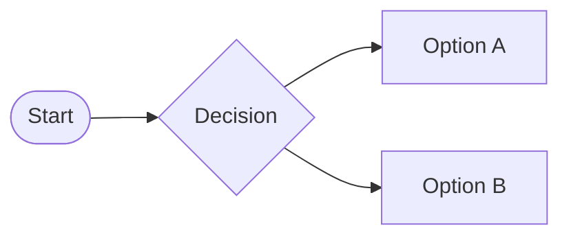

[<cite>markdown-it-mermaid-server</cite>](https://www.npmjs.com/package/markdown-it-mermaid-server) is a markdown-it plugin that generates Mermaid diagrams on the server and references them as inline SVG images in the Markdown-rendered HTML documents. The approach eliminates the need for Mermaid code on the browser client.

Enclose the Mermaid chart definition in a fenced code block, introduced by the `mermaid` keyword, like this:

~~~markdown

~~~

and get the resulting chart:

The plugin relies on [@mermaid-js/mermaid-cli](https://www.npmjs.com/package/@mermaid-js/mermaid-cli/) as a npm peer dependency,[^peer] allowing you to update the Mermaid library independently of the plugin.

The chart creation process can be configured by the optional providing of a `mermaidConfig` object, a `puppeteerConfig` object, and a `themeCSS` string.

[^peer]: <q><code>peerDependencies</code> are for dependencies that are exposed to (and expected to be used by) the consuming code, as opposed to "private" dependencies that are not exposed, and are only an implementation detail.</q>, [stack overflow](https://stackoverflow.com/a/34645112), [Peer Dependencies](https://nodejs.org/en/blog/npm/peer-dependencies)